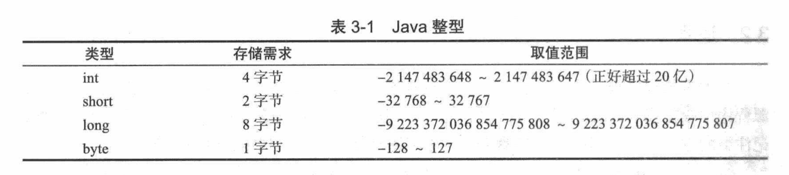
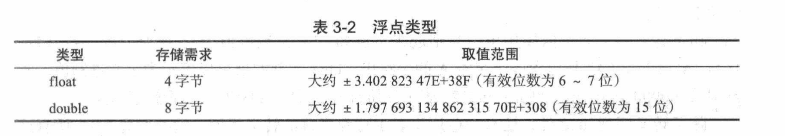

# 数据类型 #

## 基本数据类型 ##

- 整形

**遗留任务：进制数转换计算**
    
- 浮点类型

**如果在数值运算中，不允许有任何的误差，应该使用BigDecimal类**

- 字符类型

表示单个字符，用单引号括起来

- 布尔类型

false和true，用来判定逻辑条件，整型值和布尔类型之间不能相互转换

检查一个字符串不为null也不为空串

    if(str != null && str.length() != 0 )